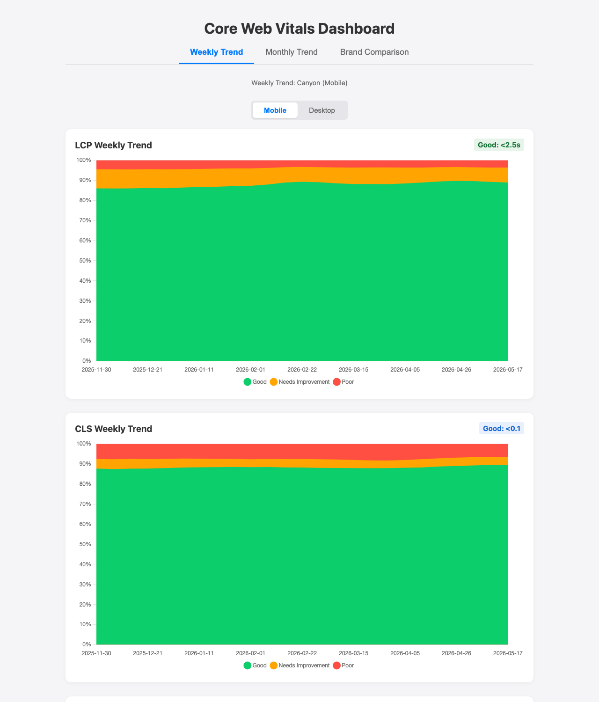
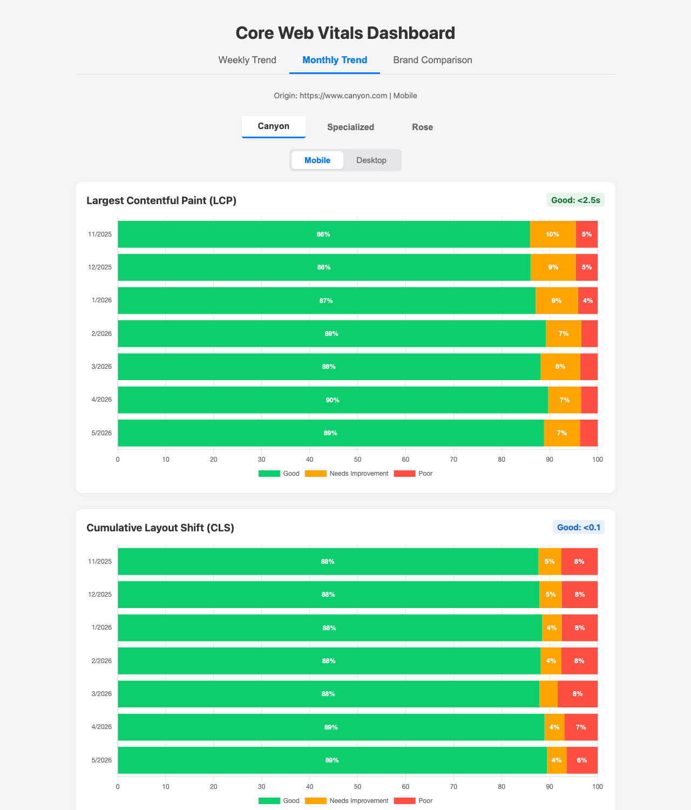
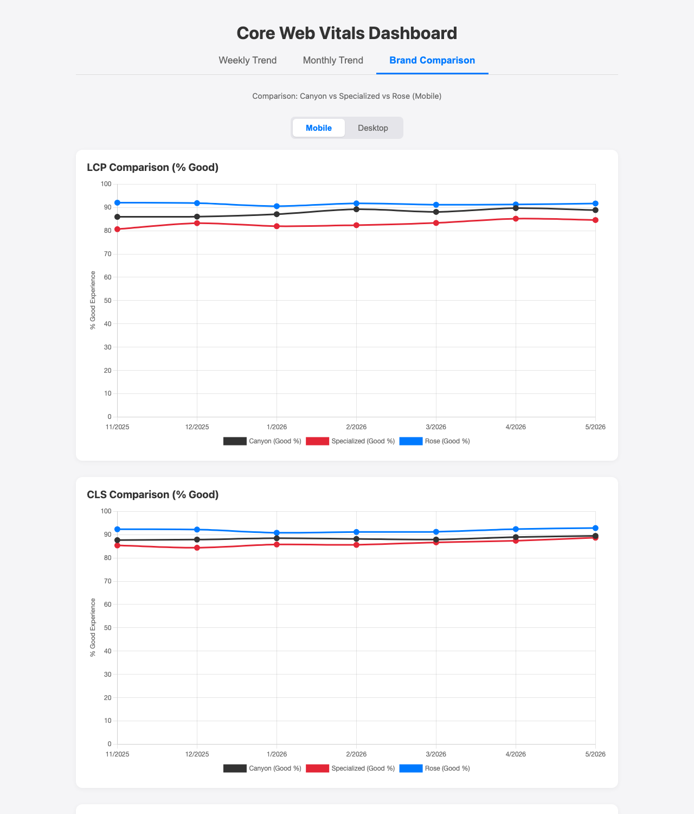

# Performance Dashboard

An automated dashboard that tracks, compares, and visualizes the web performance of **Canyon**, **Specialized**, and **Rose Bikes** over the last 12 months.

🔗 **Live dashboard:** [agentnebel.github.io/cwv-monthly-report](https://agentnebel.github.io/cwv-monthly-report/)

---

## Screenshots

| Weekly Trend | Monthly Trend | Brand Comparison |
| :---: | :---: | :---: |
|  |  |  |

---

## What is this?

This project creates **monthly reports** for the three key Google Core Web Vitals metrics – for all three bike brands in direct comparison:

- **LCP** (Largest Contentful Paint) – Loading Speed
- **CLS** (Cumulative Layout Shift) – Visual Stability  
- **INP** (Interaction to Next Paint) – Interactivity

---

## Three Views

The dashboard offers three different perspectives, accessible via tabs at the top:

### 1. Weekly Trend

Shows the **week-by-week** evolution of Canyon's Core Web Vitals as stacked area charts (LCP, CLS, INP).

**Features:**
- **Device Selection:** Mobile 📱 vs Desktop 💻 with one click
- **Granular Trend:** Spot short-term regressions or improvements week over week

### 2. Monthly Trend

Shows the detailed monthly performance of a single brand.

**Features:**
- **Brand Selection:** Switch between Canyon 🚴, Specialized ⚡, and Rose 🌹
- **Device Selection:** Mobile 📱 vs Desktop 💻 with one click
- **Detailed Charts:** Stacked bars showing Good / Needs Improvement / Poor distribution
- **PDF Export:** Download the current report

**What the charts show:**
- 🟢 **Good** – Users have a fast, stable experience
- 🟡 **Needs Improvement** – Moderate experience
- 🔴 **Poor** – Slow or unstable experience

### 3. Brand Comparison

Shows all three brands directly side-by-side as **line charts**.

**Features:**
- **Direct Comparison:** All brands in the same chart
- **Color Coding:**
  - Canyon: Dark Grey (`#333333`)
  - Specialized: Red (`#E32636`)
  - Rose: Blue (`#007aff`)
- **Metric Focus:** Shows the "% Good" trend over 12 months
- **Trend Detection:** Instantly spot which brand is performing best

---

## How does it work?

### Data Source

Data comes directly from the **Chrome User Experience Report (CrUX)** – real user data from millions of Chrome browsers worldwide.

### Automation (ALL Brands)

A **GitHub Action Workflow** runs automatically:

- **When?** On the 1st of every month (approx. 8:00 AM UTC)
- **What does it do?** Fetches the latest Google data for ALL domains and updates the charts
- **How often?** Once per month automatically, but can also be triggered manually

**Six Datasets:** The workflow automatically fetches:
1. Canyon Mobile & Desktop (`https://www.canyon.com`)
2. Specialized Mobile & Desktop (`https://www.specialized.com`)
3. **Rose Bikes Mobile & Desktop (`https://www.rosebikes.de`)**

---

## Setup & Configuration

### GitHub Pages

The dashboard is hosted on GitHub Pages. To ensure it updates correctly:
1. Go to **Settings** > **Pages**
2. Under **Build and deployment**, select **Source: GitHub Actions**

### API Key

The project uses the Google CrUX API. The key is stored securely as a GitHub Secret:
- **Secret Name:** `CRUX_API_KEY`

---

## Change Log

**February 2026**
- ✅ **Rose Bikes added:** Now tracking 3 brands
- ✅ **English UI:** Dashboard translated to English
- ✅ **Brand Comparison:** 3-way comparison (Canyon vs Specialized vs Rose)
- ✅ **Automated Updates:** Now fetching 6 datasets per run
- ✅ **Modern Workflow:** Deploys directly from `main` branch via GitHub Actions

---

*Project created: February 2026 | Automated via GitHub Actions | Data: Google CrUX | Hosting: GitHub Pages*
